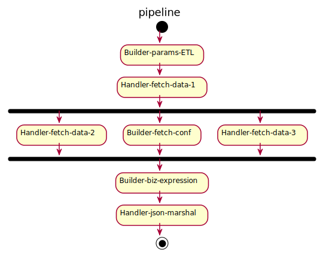

pipeline
------

Configurable data processing in golang. 


### Install
```bash
go get github.com/Focinfi/pipeline
```

### Processing Flow


1. Handler-*: References a existing Handler
2. Builder-*: Builds a Handler with config
3. Independent Handlers can process parallelly
